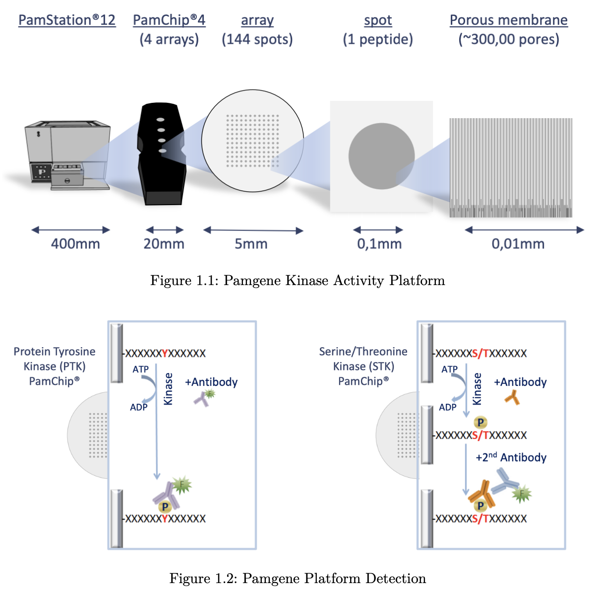
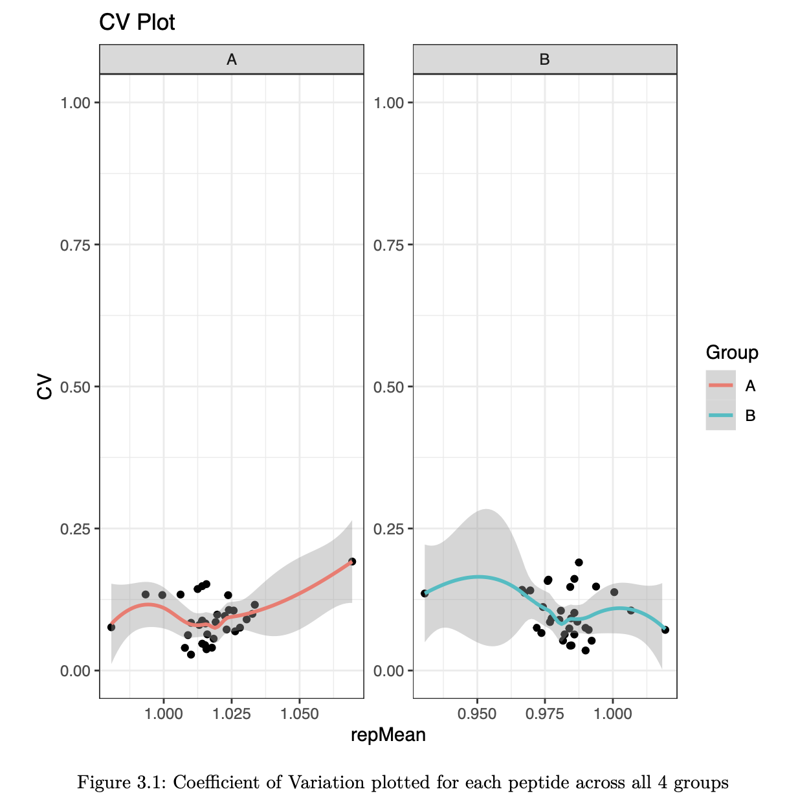
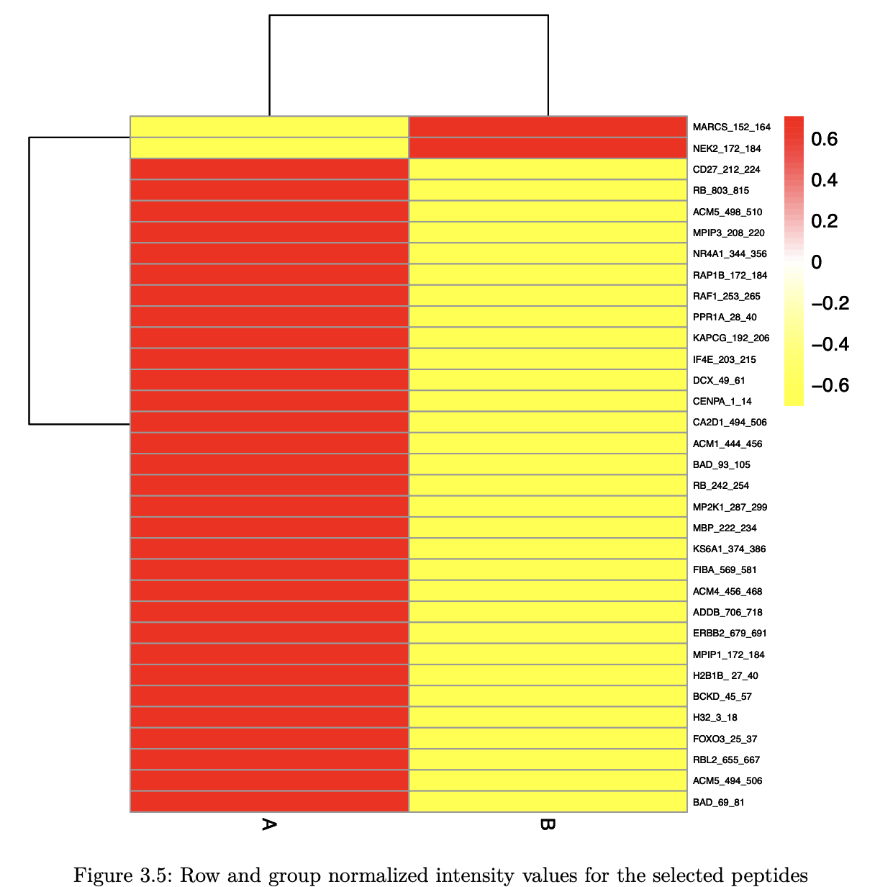

### 1. Introduction

```{r fig1-2, echo = F, fig.cap = "Figure 1.2: Pamgene Platform Detection", out.width = '100%'}

```

***
The Pamstation12 instrument provides a profiling of kinase activity of cell or tissue samples. The device is loaded with either serine/threonine or tyrosine microarray chips. Each chip has 4 wells so four samples can be loaded on a single chip, and the Pamstation12 can accommodate 3 chips per run. The microarray represents 144 (STK chip) or 196 (PTK chip) reporter peptides that can be phosphorylated by serine/threonine or tyrosine kinases. The device measures the degree of the phosphorylation in real time by detecting fluorescently labeled antibodies at different exposure times. The list of peptides present in each microarray can be viewed here: STK chip, PTK chip

### 2. Run Design

Designing the placement of the samples on the chips and arrays is important to consider due to the variability across different chips and batches. During the run some wells are subject to fail and their data cannot be analyzed and shown below as red.

### 3. Results: Intro
**3.1 Image Analysis**\n
The first step of analyzing the run is to convert the images taken by the PamStation of each array at different exposure times to numerical values This is done by the Bionavigator soft- ware developed by Pamgene. The software recognizes the grid of the array with the aid of the searching algorithm (Pamgrid) to correctly identify each spot on the array. The num- bers produced by this software represent the median value of the foreground pixels minus the median value of the background pixels to produce the median signal minus background (Median_SigmBg).

**3.2 Reading Data**\n
The first step will be reading the crosstab view bionavigator files (Median_SigmBg and Sig- nal_Saturation) and defining the PamChip type (STK or PTK). The raw data is read and then transformed to be in tidy format for an easier analysis, modeling, and visualizing.

**3.3 QC Initial Steps and Groups Assignments**\n
We will perform a couple of quality control steps to deal with negative values in the data and adjust based on signal saturation (optional). Next, we will define a new column to represent the grouping. And then, we will extract end point signal values

**3.4 QC Steps and Model Fitting**\n
We will filter out peptides with low signals. In order to combine the values from different exposure times into a single value, a simple linear regression model of the Median_SigmBg as a function of exposure time is fitted. The slope of of the model fit and 𝑅2 are then used for quality control and samples comparison. The slope is also scaled by multiplying by 100 and log2 transformed (Slope_Transformed). We then filter out peptides with poor linear fit and references peptides.

**3.5 Global Signal Intensity**
For a global signal intensity across all samples/groups, few figures can be plotted based on the Slope_Transformed values.

### Results: 3.5.1 Global CV Plots
```{r fig3-1, echo = F, fig.cap = "Figure 3.1: Coefficient of Variation plotted for each peptide across all 4 groups", out.width = '100%'}

```
***
We will plot the coefficient of variation on both the normal and normalized fits. This will help us to identify groups with high variation that could be explained by sample outliers.

### Results: 3.5.2 Global Violin Plots
```{r fig3-2, echo = F, fig.cap = "Figure 3.2: Violin Plots for signal intensity Distribution Across Groups for all replicates", out.width = '100%'}


```
***
We will plot violin figures to examine global signal differences between groups/samples.

### Results: 3.5.3 Global Heatmaps

<div style="width: 100%;">
  <div style="width: 50%; height: 100px; float: left"> 
  </img>
  </div>
  <div style="margin-left: 50%; height: 100px"> 
  </img>
  </div>
</div>

***
The heatmap represent all the peptides present on the chip except the positive/internal controls and peptides that failed to pass QC. The heatmaps are scaled by row to highlight the peptide signal differences across the samples. A hierarchical unsupervised clustering is applied both on the peptides and the samples to group potentially similar signatures.

### Results: 3.6 Group Comparison
To compare between samples, a two-group comparison is performed. In this case, there are three group comparisons:
• B vs A
The Slope_Transformed ratio between each group, paired by chip, is calculated to the fold change. Based on the fold change, peptides that pass a certain fold change threshold are considered significant hits. Also, quality control steps applied in each comparison to filter out peptides that do not reach specific criteria:
• The Median_SigmBg at max exposure 100ms must be above a certain value • 𝑅2 of the linear model fit must be above a threshold value

These Filtering Parameters (fold change threshold, QC criteria) can be modified to adjust the stringency of the analysis. The Filtering Parameters that are used for this analysis:
• The Median_SigmBg at max exposure 100ms must be equal or above 5 • 𝑅2 of the linear model fit must be above or equal 0.8
• Log fold change (LFC) cutoffs at (0.2,0.3,0.4)

### 3. Results: 3.6.0.1 Heatmap
```{r fig3-6, echo = F, fig.cap = "Filtered heatmap", out.width = '100%'}

```
***
After applying the Filtering Parameters for this group comparison, only 20/141 peptides carried forward in the analysis (i.e. 20 hits). Below are some figures to visualize the differences between these samples for considering these hits.

### 3. Results: 3.6.0.2 Violin Plot
```{r fig3-6-2, echo = F, fig.cap = "Figure 3.6: Violin plot of two groups", out.width = '100%'}

```
***
Below, the violin plot visualizes the distribution of selected peptides for the analysis.

### 3. Results: 3.6.0.3 Waterfall Plot

<div style="width: 100%;">
  </img>
</div>

***
This waterfall represents the log2 fold changes between the two groups at each peptide.

### 3. Results: 3.6.0.4 Upstream Kinase Analysis
```{r fig3-8-2, echo = F, fig.cap = "Upstream Kinase Analysis", out.width = '100%'}

```
***
The lab carefully curated and mapped the kinases that can act and phosphorylate each peptide present on the chip. This was achieved by using multiple sources including GPS 3.0, Kinexus Phosphonet, PhosphoELM and PhosphoSite Plus. Based on that association between peptides and kinases, a random sampling analysis is performed for these hits. The basic idea of KRSA is: For each iteration (2000 iterations performed in this analysis), the same number of hits are randomly selected from the total 141/or 193 peptides present on the chip. Predicted kinases are then mapped to this sample list of peptides and number of kinases are determined. The kinase count from the actual hits and random sampling is then compared to determine the significance.

### 3. Results: 3.6.0.5 Z Scores Plot
```{r fig3-8, echo = F, fig.cap = "Figure 3.8: Waterfall plot of the Z Scores of each kinase family", out.width = '100%'}

```
***
We will plot the individual and averaged Z scores using both the across and within chip analyses.

### 3. Results: 3.6.0.6 Reverse KRSA Plot
```{r fig3-9, echo = F, fig.cap = "Figure 3.9: Kinase Activity summary for each kinase family based on peptide phosphorylation", out.width = '100%'}

```
***
We will use the reverse KRSA plot function, to plot the log2 fold change values for all peptides mapped to kinase hits. This will help us examine the activity of the kinase

### 3. Results: 3.6.0.7 Coverage Plot
```{r fig3-10, echo = F, fig.cap = "Figure 3.10: Percentage of peptides each kinase family phosphorylates", out.width = '100%'}

```
***
To view the coverage of kinases across the full list of peptides on the chip, we will use the coverage plot function

### 3. Results: 3.6.0.8 Ball Model Network
```{r fig3-11, echo = F, fig.cap = "Figure 3.10: Ball Model Network", out.width = '100%'}

```
***
To view the coverage of kinases across the full list of peptides on the chip, we will use the coverage plot function


